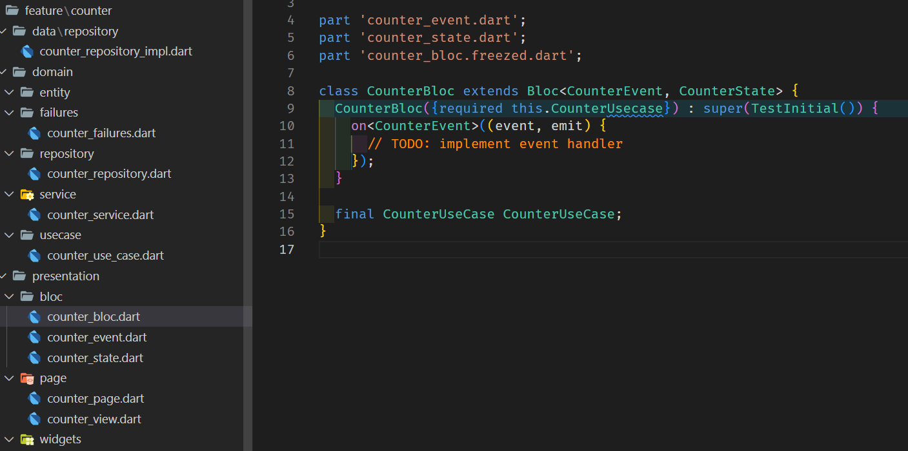

# VS-Code flutter-clean-feature README

> ### This extension is based on [felangel](https://github.com/felangel) BLoC extension

## Directory structure example

For example, let's take the counter feature:

## New Feature Command Usage

You can activate the command by right click on the directory in which you'd like to create the feature and select the "New Feature" command from the context menu.