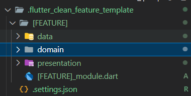
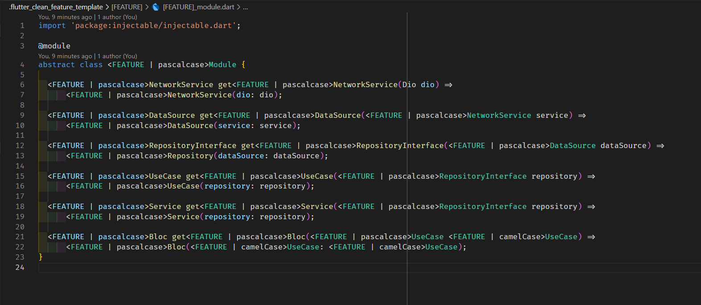

# VS-Code flutter-clean-feature README

> ### This extension is based on [felangel](https://github.com/felangel) BLoC extension

## Directory structure example

For example, let's take the counter feature:

## New Feature Command Usage

You can activate the command by right click on the directory in which you'd like to create the feature and select the "Create New Flutter Clean Feature" command from the context menu.

Also you can create folder .flutter_clean_feature_template with [FEATURE] subfolder in root of workspace and write your own template

and inside file write something like

supported naming cases

**lowercase**
**uppercase**
**camelcase**
**pascalcase**
**capitalcase**
**constantcase**
**dotcase**
**nocase**
**pathcase**
**sentencecase**
**snakecase**
**singular**
**plural**
**lowercasefirstchar**
**capitalize**
